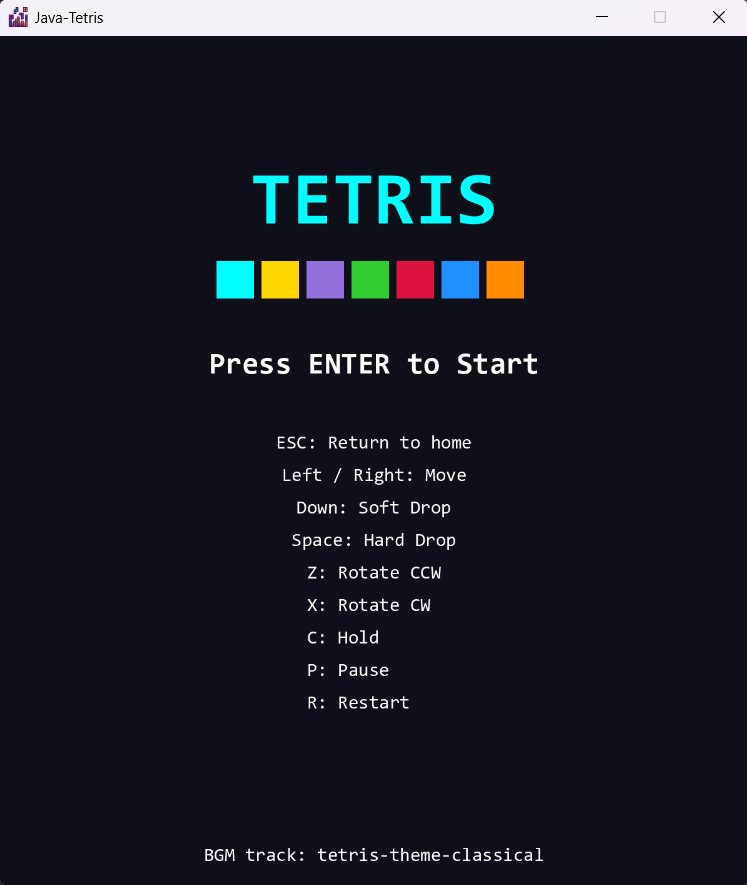
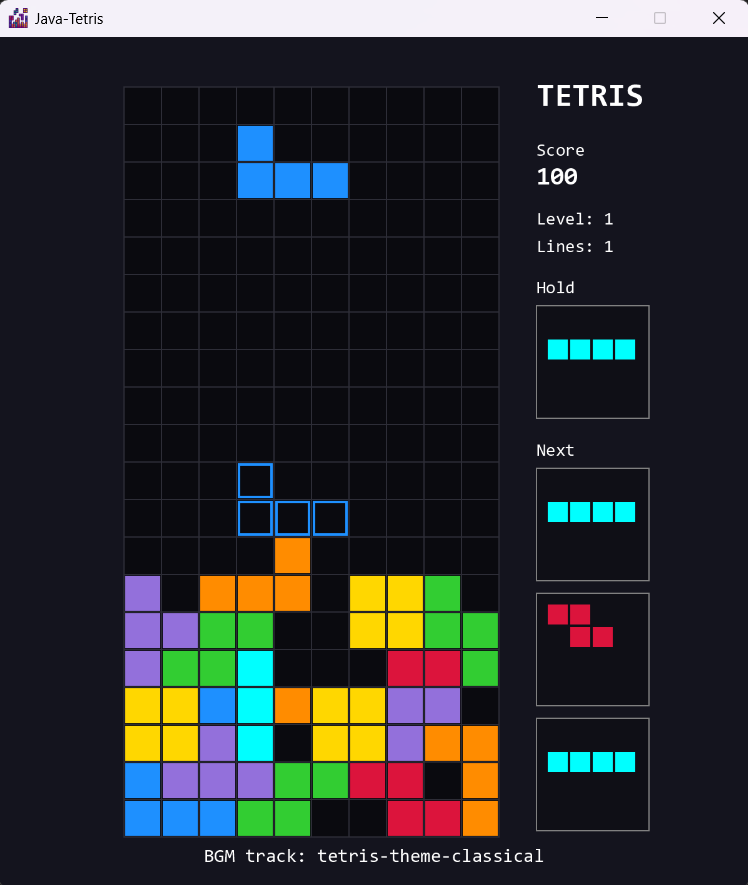
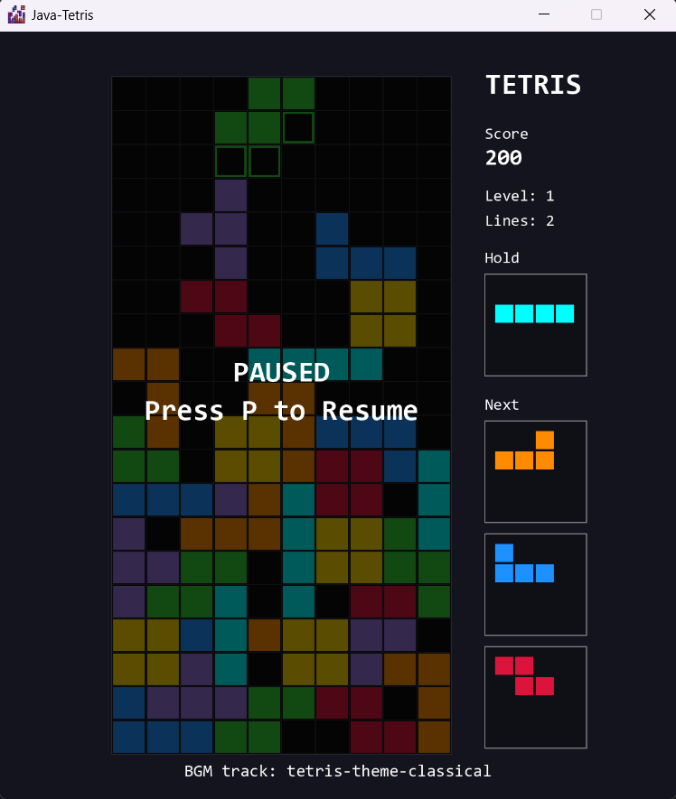
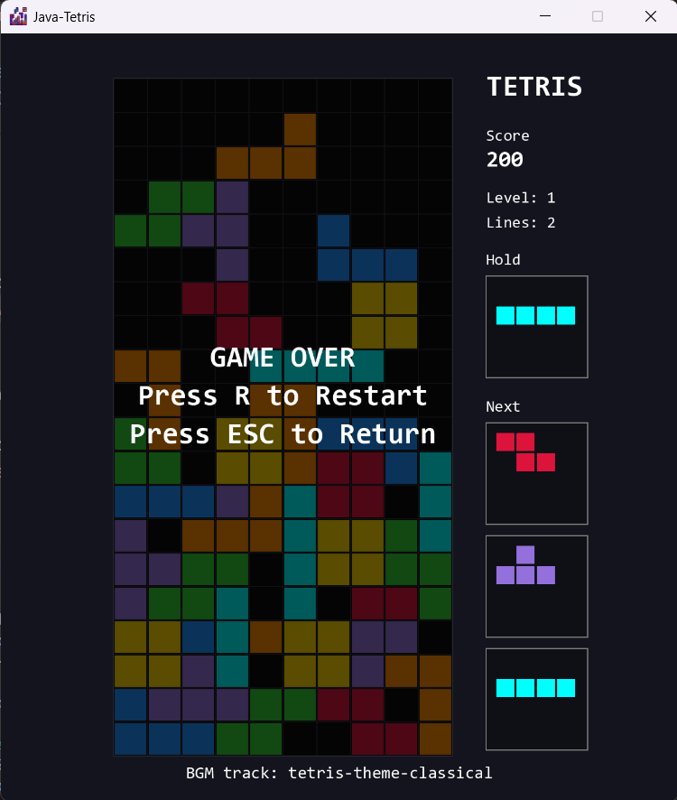

# Java-Tetris
 [](https://github.com/AlmasB/FXGL/releases#release-25)  [](./README.md)

A simple Tetris game built with Java and the [FXGL](https://github.com/AlmasB/FXGL) game library.

## Project Structure
```
Java-Tetris/
│
├── src/main/
│   ├── java/com/mingminna/tetris
│   └── resources/assets
├── demo/
├── pom.xml
├── LICENSE
└── README.md
```

If you are not familiar with Maven, you might wonder why the project has so many seemingly unnecessary directories. This is simply how Maven structures a Java project. 

## Requirements

- Java 25
- FXGL 25
- Maven 3.9.16 or later

## Getting Started

### 1. Clone the repository

Clone the repository and enter the project directory.

```bash
$ git clone https://github.com/MingMinNa/Java-Tetris.git
$ cd Java-Tetris
```

### 2. Check Java and Maven

Make sure both Java and Maven are installed and available in your `PATH`.

```bash
$ mvn --version
# Apache Maven 3.9.x

$ java --version
# openjdk 25.0.x
```

### 3. Compile

To compile the project:

```bash
$ mvn clean compile
```

Or, to create a packaged JAR:

```bash
$ mvn clean package
```

### 4. Run

You can run the game directly through the Maven Exec Plugin:

```bash
$ mvn exec:java
```

If you have already packaged the project into a JAR:

```bash
$ java -jar ./target/tetris.jar
```

## Demo

[Watch Demo Video](./demo/video/Demo_Video.mp4)

<table border="0">
<tr>
<td width="50%" align="center">
    <strong>Home</strong><br><br>
    
</td>

<td width="50%" align="center">
    <strong>Game Play</strong><br><br>
    
</td>
</tr>

<tr>
<td width="50%" align="center">
    <strong>Pause</strong><br><br>
    
</td>

<td width="50%" align="center">
    <strong>Game Over</strong><br><br>
    
</td>
</tr>
</table>

## Tools & Resources
- [Apache Maven](https://maven.apache.org/)
- [AlmasB/FXGL](https://github.com/AlmasB/FXGL)
- [Tetris Theme - Korobeiniki (GregorQuendel)](https://pixabay.com/zh/users/gregorquendel-19912121/)
- [Tetris Icon - Flaticon](https://www.flaticon.com/free-icon/tetris_1006985?related_id=1006934&origin=search)

## Notes
This project was originally created as a course project and was no longer maintained after the course ended. As part of reorganizing my GitHub repositories, I decided to clean up and improve the project while preserving the original code in the [`legacy`](https://github.com/MingMinNa/Java-Tetris/tree/legacy) branch.